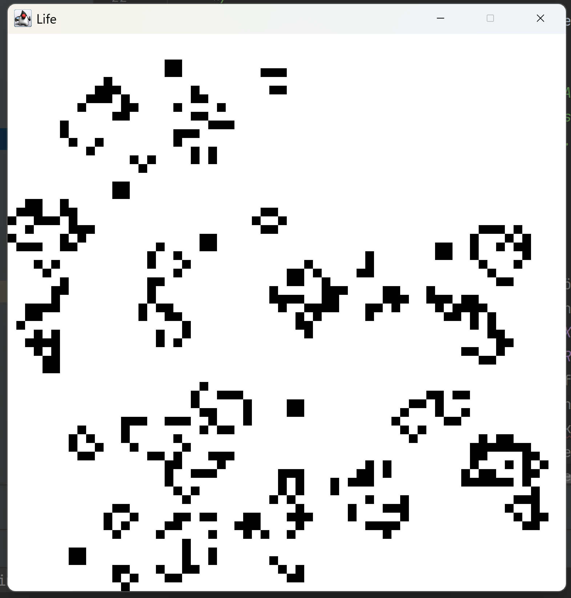

# Game of Life — Java Simulation Project

A Java implementation of **Conway’s Game of Life**, created to explore object-oriented programming and basic simulation logic.

---

## Components & Structure

```
|-src/
    |-main/
        |-java/
        |-life/
        |-Cell.java
        |-CellFactory.java
        |-gol_preview.png
        |-LifeApp.java
        |-LifeBoard.java
        |-LifeCell.java
        |-package-info.java
```


- **Cell.java** – Interface defining the basic behavior of a cell (e.g., being born, dying, checking neighbors).
- **LifeCell.java** – Concrete implementation of the `Cell` interface that stores and updates each cell’s state.
- **CellFactory.java** – Responsible for creating and initializing cells in the grid.
- **LifeBoard.java** – Manages the entire grid, handles updates and simulation steps.
- **LifeApp.java** – Entry point that starts and runs the Game of Life simulation.
- **package-info.java** – Contains package-level documentation.
- **target/** – Compiled output directory.
- **.idea/** – IntelliJ project configuration.

---

## Preview



---

## 🇬🇧 English

### About the Project
This project implements **Conway’s Game of Life** in Java using an existing structure.  
It was built to practice **object-oriented programming principles**, class design, and logical thinking in a grid-based simulation environment.

### Learning Aspect
The project helped strengthen my understanding of **Java class structure, object creation, and state management**,  
as well as how simple rules can lead to complex patterns in computational systems.

### Technologies
- Java
- IntelliJ IDEA (development environment)

### Author
Construct was created by **Aleksander Travanov**
Projekt was finished by **Martin Vitcov**

---

## 🇩🇪 Deutsch

### Über das Projekt
Dieses Projekt ist eine Java-Umsetzung des **Game of Life** von *John Conway* mit hilfe eines vorgefertigen Konstrukts.  
Es wurde entwickelt, um **objektorientierte Programmierung**, Klassendesign und logisches Denken  
in einem simulationsbasierten Umfeld zu üben.

### Lernaspekt
Das Projekt half mir, mein Verständnis für **Java-Klassenstrukturen, Objekt­erstellung und Zustandsverwaltung** zu vertiefen  
und zu erkennen, wie einfache Regeln zu komplexem Verhalten in Systemen führen können.

### Technologien
- Java
- IntelliJ IDEA (Entwicklungsumgebung)

### Autor
Konstrukt erstellt von **Aleksander Travanov**
Fertigstellung durch **Martin Vitcov**


